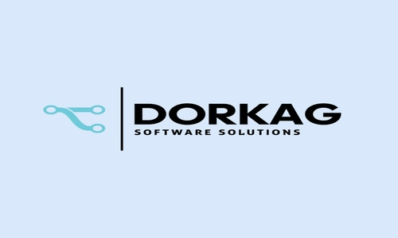

# Dorkag

## Documentation

## Plugins

----

**AZD**

Azure DevOps Pull Request and Pipeline integration in your IDE

Links:

- [Marketplace](https://plugins.jetbrains.com/plugin/22319-azd)
- [Documentation](https://edgafner.github.io/azd.html)
- [GitHub Issues](https://github.com/edgafner/dorkag/issues)

-----

**GBrowser**

An Embedded Browser in the IDE

Links:

- [Marketplace](https://plugins.jetbrains.com/plugin/14458-gbrowser)
- [Documentation](https://edgafner.github.io/gbrowser.html)
- [GitHub Issues](https://github.com/edgafner/dorkag/issues)

----

**Codecov**

Validates your codecov configuration in the IDE.

Links:

- [Marketplace](https://plugins.jetbrains.com/plugin/23390-codecov)
- [Documentation](https://edgafner.github.io/codecov.html)
- [GitHub Issues](https://github.com/edgafner/dorkag/issues)

----

**QueryFlag**

evaluate DataBase values from selected text with template queries:

- [Marketplace](https://plugins.jetbrains.com/plugin/18269-queryflag)
- [Documentation](https://edgafner.github.io/queryflag.html)
- [GitHub Issues](https://github.com/edgafner/dorkag/issues)

----

**Run Like Me**

Share template run configurations with your team:

Links:

- [Marketplace](https://plugins.jetbrains.com/plugin/24906-run-like-me)
- [Documentation](https://edgafner.github.io/runlikeme.html)
- [GitHub Issues](https://github.com/edgafner/dorkag/issues)
