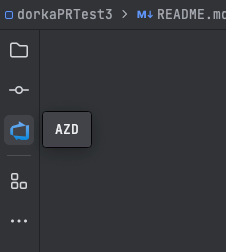
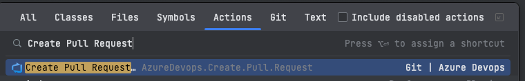
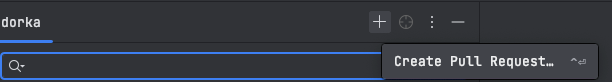
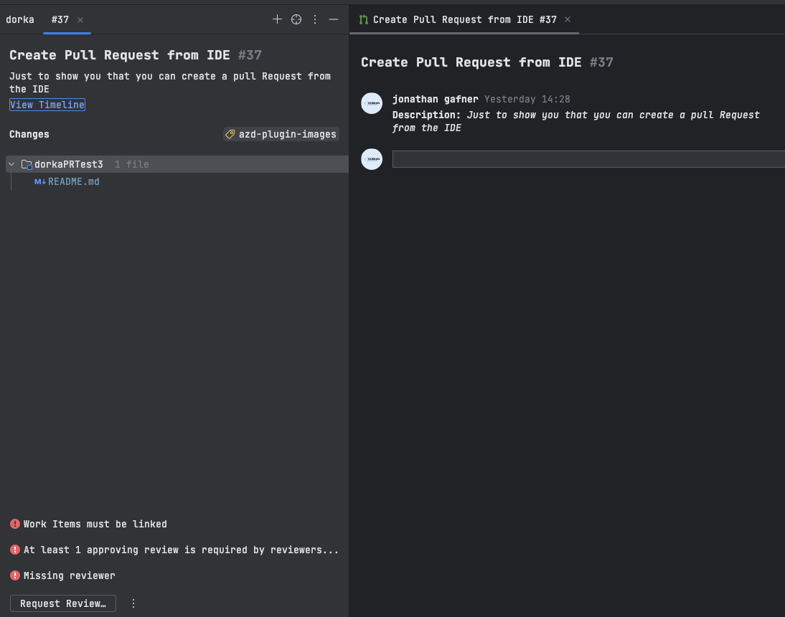
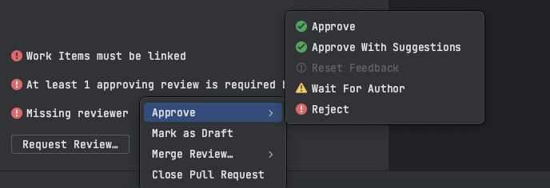
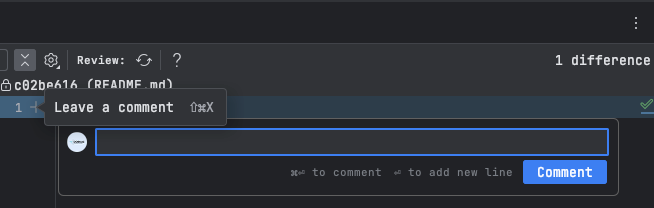
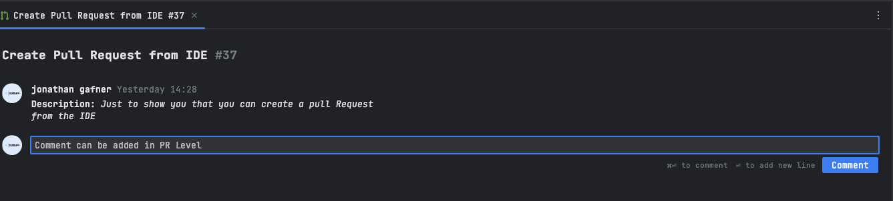

# AZD IntelliJ Plugin Usage Guide

The AZD IntelliJ Plugin integrates Azure DevOps pull request workflows directly into your JetBrains IDE. This guide provides an overview of its main features and demonstrates how to utilize them effectively.

## Table of Contents

- [Viewing Pull Requests](#viewing-pull-requests)
- [Managing Pull Requests](#managing-pull-requests)
- [Reviewing Pull Requests](#reviewing-pull-requests)
- [Direct Links to Azure DevOps](#direct-links-to-azure-devops)

## Viewing Pull Requests

1. **Access AZD Tool Window**:
   - Navigate to the AZD tool window, typically located on the right-hand side of your IDE.   

2. **See Pull Requests**:
   - Within the AZD tool window, you'll see a list of all pull requests related to your projects.
   - Click on any pull request to view its details.
   - Filter pull requests by Active, Closed, or Abandoned status, or by Author or Reviewers. 

## Managing Pull Requests

1. **Open a New Pull Request**:
   - Inside the AZD tool window, click on the `+` button or search for `Create Pull Request` in the actions search.
   - Provide a title, description, add reviewers as needed, and click 'Create'.
   - You can also initiate a pull request in Draft mode.    OR   

2. **Merge, Close or Abandon a Pull Request**:
   - Select the pull request you wish to close.
   - You have the option to merge it, abandon it, or convert it to a draft.   

3. **Vote for a Pull Request**:
   - At the bottom of each open pull request, look for the three dots menu where you can cast a vote for the selected pull request.   

## Reviewing Pull Requests

1. **Access Review Panel**:
   - Click on a pull request to enter its review panel.

2. **Add Comments**:
   - Highlight specific lines of code or sections to add inline comments.
   - Click on 'Submit' after entering your comment.       

3. **Reply to Existing Comments**:
   - Click on an existing comment to view options.
   - Select 'Reply' and type in your response.

4. **Update or Delete Comments**:
   - To update a comment, click on the edit icon next to your comment, make your changes, and confirm.
   - To delete a comment, click on the trash bin icon next to your comment.

5. **Manage Comment Threads on Files**:
   - Within a file, you can initiate a thread by commenting on a specific line or code block.
   - These threads allow multiple users to participate in a discussion related to that specific code segment. Threads can be resolved, reopened, updated, or deleted.

## Direct Links to Azure DevOps

1. **Open Linked Pages**:
   - Within any pull request or comment, Azure DevOps-related links will be clickable.
   - Clicking on these links will open the corresponding Azure DevOps page in your default browser.

---

## Pull Request Timeline

The timeline provides a chronological overview of significant events and interactions within a pull request. It's a key tool for tracking the progress, understanding the history, and identifying areas of discussion or contention in a pull request.

1. **Accessing the Timeline**:
   - Open a pull request to view its details.
   - Navigate to the 'Timeline' file editor.

2. **Understanding Timeline Entries**:
   - The timeline will display a variety of events, including:
      - Comments and replies made by reviewers and contributors.
      - Commits added or associated with the pull request.
      - Status updates, such as when a pull request is opened, reviewed, or merged.
      - System notifications, like CI/CD results or automated checks.
      - Manual events like label additions or changes in assignees.

3. **Interacting with the Timeline**:
   - You can click on specific timeline entries to view more details or jump to related files or discussions.
   - Some entries allow for direct interaction, like replying to comments or viewing commit diffs.

The pull request timeline is an invaluable tool for staying updated on the progression and discussions surrounding your code changes.

---

For detailed installation instructions, return to [INSTALLATION.md](INSTALLATION.md) or refer to the main [README.md](README.md) for a complete overview.
