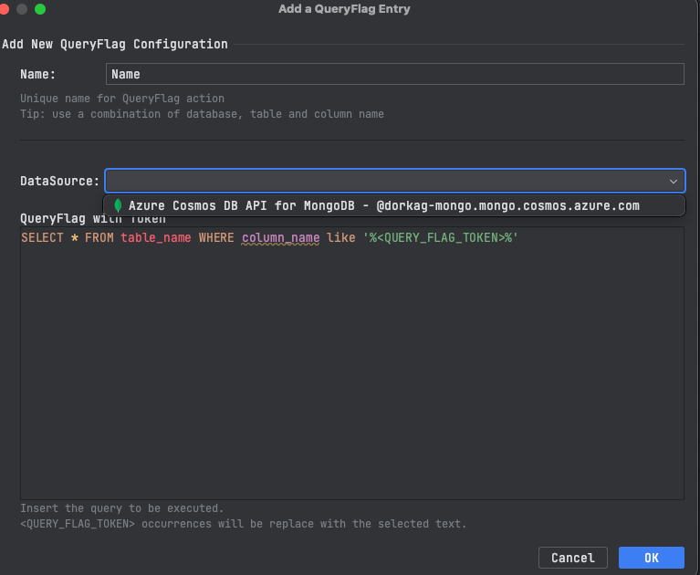

# Query Flag IntelliJ Plugin Usage Guide

With the QueryFlag plugin, you can define and execute template-based queries on selected text, making it easy to replace a single query parameter from within your editor. By following a few simple steps, you can streamline your workflow and improve productivity.

## Table of Contents

- [Add Query Flag Templates](#AddQueryFlagsTemplate)
- [Run Query with selected value](#RunQuery)

## AddQueryFlagsTemplate

1. **Configure the Plugin**:
   - Navigate to the plugin's settings: Settings -> Tools -> Databases -> QueryFlag
   - Add a new query flag: </br>  
      - Give a short and useful name - (db-table names is consider a good practice)
      - Select your existing datasource in the DataSource combobox
      - Add a query with a token `<QUERY_FLAG_TOKEN>` to be replaced with selected string. examples:
         - ``` SELECT * FROM dorkgadb where name like '%<QUERY_FLAG_TOKEN>%' ```
         - ``` db.getSiblingDB("dorkag-db").getCollection("dorkag-collection").find({"name": {$regex: /<QUERY_FLAG_TOKEN>/}}) ```
   - Save your settings.

## RunQuery
1. **Enjoy the Integration**:
   - Select a string in the text editor you want use with the query flag.
   - Right click on it and select Query Flag in DB and the Query Flag name you chose 
   - Now Query Flag will run you query replacing the token with the selected string, and you will be able to see the results in your IDE


---

For detailed installation instructions, return to [INSTALLATION.md](INSTALLATION.md) or refer to the main [README.md](README.md) for a complete overview.
